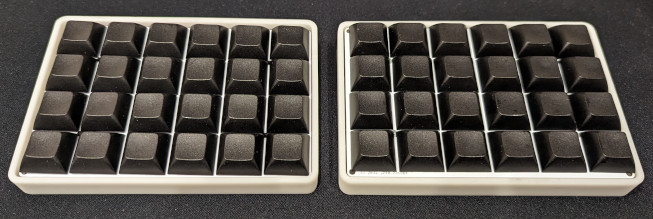
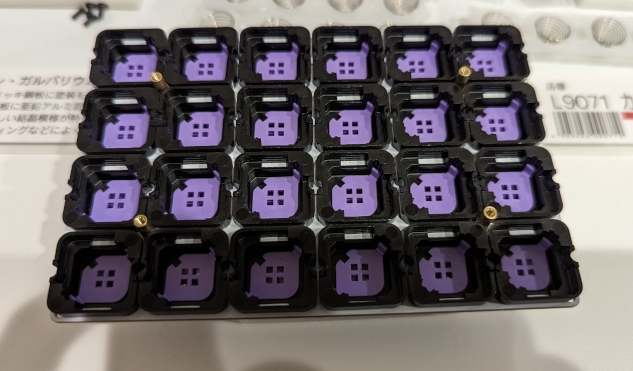

# Let's EC Build Guide




- [Let's EC Build Guide](#lets-ec-build-guide)
  - [部品](#部品)
    - [キット同封品](#キット同封品)
    - [その他必要なもの](#その他必要なもの)
  - [ハンダ付け](#ハンダ付け)
  - [組み立て](#組み立て)
  - [Firmware](#firmware)
  - [左右通信用 USB 接続](#左右通信用-usb-接続)
    - [キーマップ変更](#キーマップ変更)
    - [閾値調整](#閾値調整)
  - [firmware をバグらせたら](#firmware-をバグらせたら)
  - [ストレージとしてマウントさせないようにするには](#ストレージとしてマウントさせないようにするには)


## 部品
### キット同封品

| 品目                    | 数量 | 備考 |
|-------------------------|------|------|
| PCB                     |    2 |      |
| トッププレート          |    2 |      |
| USB Type C レセプタクル |    2 |      |
| 抵抗 100kΩ              |   14 |      |
| 抵抗 1kΩ                |    2 |      |
| コンデンサー 100nF      |    4 |      |
| コンデンサー 220pF      |    2 |      |
| マルチプレクサ          |    2 |      |
| オペアンプ              |    2 |      |
| コニカルスプリング      |   48 |      |
| ネジ                    |    8 |      |
| スペーサー              |    8 |      |
| ゴム足                  |    8 |      |


### その他必要なもの

| 品目                | 数量 | 備考       |
|---------------------|------|------------|
| 3D プリントケース   |    2 | [モデルデータ](/3d_model/lets_ec_tray.stl)。業者に発注 or ご自身で3Dプリントしてください。写真は JLCPCB で 9000R レジンで印刷したものです。 |
| XIAO RP2040         |    2 | - https://akizukidenshi.com/catalog/g/gM-17044/ <br>- https://www.switch-science.com/products/7634 <br>- https://www.marutsu.co.jp/pc/i/2229736/ <br>- https://talpkeyboard.net/items/63534f58f5197322fceb6487 |
| ハウジング          |   48 | - https://ja.aliexpress.com/item/1005005724051113.html <br>- https://www.amazon.co.jp/dp/B0C9WJQ45N?th=1 |
| プランジャー        |   48 | - https://ja.aliexpress.com/item/1005005721976294.html <br>- https://www.amazon.co.jp/dp/B0C9WF8NQQ?th=1 |
| ラバーシート        |   48 | - https://ja.aliexpress.com/item/1005005721050116.html <br>- https://www.amazon.co.jp/dp/B0C9WK97GQ/?th=1 |
| キーキャップ        |   48 | MX 互換のもの |
| USB C to C ケーブル |    1 | 左右通信用 |
| USB C ケーブル      |    1 | PC 接続用  |

## ハンダ付け

| 基板上の印字   | 対応部品         |
|----------------|------------------|
| R1~R7          | 100kΩ            |
| R8             | 1kΩ              |
| C1~C2          | 100nF            |
| C3             | 220pF            |
| U1             | XIAO RP2040      |
| U2             | マルチプレクサ   |
| U3             | オペアンプ       |
| なし(基板左上) | USB レセプタクル |

抵抗とコンデンサーの向きの指定はありません。マルチプレクサ、オペアンプは基板に書かれている小さな丸と IC に書かれている丸(または丸いくぼみ)が同じ向きになるようにはんだ付けしてください。

ハンダ付けが終わると下図のようになります。


## 組み立て


- トッププレートにスペーサーをネジ止めします。
- ハウジングをトッププレートにはめ、プランジャーをハウジングにはめていきます。
- ラバーシートをかぶせ、コニカルスプリングを置きます
- 基板を被せます
- 最後に印刷した3Dプリントケースをかぶせネジを止め、ゴム足を貼り付けたら完成です。





## Firmware

XIAO RP2040 用の CircuitPython を[ダウンロード](https://circuitpython.org/board/seeeduino_xiao_rp2040/)します。
(動作確認は [version 8.2.9](https://adafruit-circuit-python.s3.amazonaws.com/bin/seeeduino_xiao_rp2040/en_US/adafruit-circuitpython-seeeduino_xiao_rp2040-en_US-8.2.9.uf2) で行いました。)

bootloader mode で起動し、ダウンロードした `uf2` ファイルをコピーします。手順は公式 doc を参照してください。
- bootloader mode への入り方
  - https://wiki.seeedstudio.com/XIAO-RP2040/#enter-bootloader-mode
- circuit python インストール方法
  - https://learn.adafruit.com/welcome-to-circuitpython/installing-circuitpython#bootloader-mode-3105160

コピーし終わると `CIRCUITPY` という名前でストレージがマウントされます。
後のためにストレージ名を左手用のマイコンは `NYQUISTL`, 右手用は `NYQUISTR` にリネームしておいてください。**リネームを行わないと分割キーボードとして機能しません**。
- リネームの仕方
  - https://learn.adafruit.com/welcome-to-circuitpython/renaming-circuitpy


次にマウントされたストレージに firmware プログラムを配置します。

```bash
git clone --recursive https://github.com/goropikari/LetsEC
```

`kmk_firmware` ディレクトリ配下の kmk ディレクトリをまるごとストレージ直下に配置、`firmware` ディレクトリ配下の Python プログラムをストレージ直下に配置します。

全てのファイルを配置したあとは以下のようなディレクトリ構成になります。

```bash
.
├── boot.py
├── code.py
├── kmk/
├── scanner.py
└── settings.toml
```

これを両手分行ってください。
両手のマイコンに配置したら一度 USB ケーブルを抜き再度接続してください。このときはストレージとしてマウントされません。USB ケーブルは左右どちらに接続しても構いません。
タイピングしてみてキーが入力されたら成功です。

## 左右通信用 USB 接続

左右通信用の USB ケーブルは絶対に PC とは接続しないでください。接続すると壊れます。
左右通信用のケーブルはキーボード端にある方の USB レセプタクル同士で接続し、PC との接続は XIAO RP2040 につないでください。
XIAO RP2040 への接続は前途の通り左右どちらでも構いません。


### キーマップ変更

`code.py` を修正してお好みのキーマップにしてください。


最新の KMK Firmware と、このリポジトリで git submodule として使っている kmk では使用できるキーコードが変わっている可能性があります。その場合は、submodule として入れている kmk の doc を参照してください。

### 閾値調整

`settings.py` で `DEBUG=0` になっている部分を `DEBUG=1` にし、USB ケーブルを抜き差しすると各スイッチの電圧が出力されるようになります。このときはキーを押しても何も入力されません。

出力は [picocom](https://wiki.archlinux.jp/index.php/%E3%82%B7%E3%83%AA%E3%82%A2%E3%83%AB%E3%82%B3%E3%83%B3%E3%82%BD%E3%83%BC%E3%83%AB#picocom) や [Mu editor](https://codewith.mu/) を使うと見ることが出来ます。下図は Mu editor を使って出力値をプロットしているところです。


この出力値を参考に閾値を調節してください。初期値は下記のように設定されています。

```python
low_threshold=2.0,
high_threshold=2.1,
```

ここで `high_threshold`, `low_threshold` は [tomsmalley/custom-topre-guide](https://github.com/tomsmalley/custom-topre-guide/blob/c4a8cadadc9f8ab422d9cba28a28701198a1bd22/README.md#overview) における Actuation Depth, Release Depth にそれぞれ対応します。
簡単に言うとある電圧(high_threshold)よりも上ならばキーが押された、ある電圧(low_threshold)よりも下ならばキーが押されていないと判定しています。

この閾値は左右のマイコンで共有されていないので、それぞれ適した値を設定してください。


## firmware をバグらせたら

キーマップやその他設定をいじっているとバグらせてしまうことが多々あります。その結果コードの書き換えが一切出来ない状態になることがあります。そのようなときは下記の記事を参考にマイコンを初期状態にリセットしてみてください。

https://zenn.dev/link/comments/c6600bde683fe6


## ストレージとしてマウントさせないようにするには

`boot.py` に以下のコードを入れるとストレージとしてマウントされなくなります。
```
storage.disable_usb_drive()
```

一方でストレージとしてマウントされないせいでキーマップや閾値を変えることができなくなります。

再びストレージとしてマウントするには

- キーボードを PC につなぐ
- mu editor でコンソールを開く
- Ctrl-C
- python REPL が立ち上がるので以下を実行

```python
import storage
storage.remount('/')
v = storage.getmount('/')
with v.open('/boot.py', 'w') as f:
    f.write(
'''
import supervisor
import usb_cdc
import storage

supervisor.runtime.autoreload = False
# usb_cdc.disable()
# storage.disable_usb_drive()
''')
```

USB を抜き差しするとストレージとしてマウントされます。


閾値の調整の影響で何かのキーが常に押された状態として認識されてしまう上記の対応が取れない場合は boot mode で XIAO RP2040 を起動し、[`flash_nuke.uf2`](https://learn.adafruit.com/getting-started-with-raspberry-pi-pico-circuitpython/circuitpython#flash-resetting-uf2-3083182) を配置することでまっさらな状態にすることができます。この状態で [Firmware](#firmware) からやり直してください。
